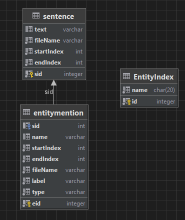

# [Database](https://github.com/Knox-AAU/PreProcessingLayer_EntityRecognitionAndLinking/blob/main/components/Db.py)
The database is responsible for keeping track of sentences, entity mentions, and entity indices.

## Features
- CRUD (Create, Read, Update, Delete) Operations supported.
- Uses [SQLite](https://www.sqlite.org/index.html).
- Seeds the database with required tables if they do not exist.

## <a name="overview"></a>Overview
The database contains the following tables:



### sentence
Contains each sentence from all input text. Has a unique `sid`.

### entitymention
Represents each entity mention from all input text. Has `sid` as foreign key (a sentence must exist for the entitymention to exist).

### EntityIndex
Used by the [Entity Linker](https://github.com/Knox-AAU/PreProcessingLayer_EntityRecognitionAndLinking/blob/main/components/EntityLinker.py) to find potential matches for a given entity mention. See [Entity Linker Docs](https://github.com/Knox-AAU/PreProcessingLayer_EntityRecognitionAndLinking/blob/main/docs/entitylinker.md) for more information. 

## Methods
```python
async def InitializeIndexDB(dbPath):
```
### Parameters:
- **dbPath** (str): A path where the database will be stored / is stored, ie. `some/path/to/a/Database/directory`.

```python
async def Insert(dbPath, tableName, queryInformation):
```
### Parameters:
- **dbPath** (str): A path where the database will be stored / is stored, ie. `some/path/to/a/Database/directory`.
- **tableName** (str): The name of the table you want to insert into, available ones can be found in [Overview](##Overview).
- **queryInformation** (JSON): A JSON object containing the key-value pairs you want to insert, for example: 
```JSON
{
    "fileName": "article.txt",
    "string": "A duck walked across the road",
    "startindex": 20,
    "endIndex": 29
}
```
Would be a valid insert in the `sentence` table.

> **_NOTE:_** The `sid` is autogenerated using `AUTOINCREMENT`.

```python
async def Read(dbPath, tableName, searchPred=""):
```
### Parameters:
- **dbPath** (str): A path where the database will be stored / is stored, ie. `some/path/to/a/Database/directory`.
- **tableName** (str): The name of the table you want to insert into, available ones can be found in [Overview](##Overview).
- The search predicate to query the table with, for example if `searchPred` = `Jones` and the `tableName` = `entitymention`, the entitymention table will be searched for `Jones`.

```python
async def Update(dbPath, tableName, indexID, updatedName):
```
### Parameters:
- **dbPath** (str): A path where the database will be stored / is stored, ie. `some/path/to/a/Database/directory`.
- **tableName** (str): The name of the table you want to insert into, available ones can be found in [Overview](##Overview).
- **indexID** (str): The `sid`, `eid` or `id` (EntityIndex) to update.
- **updatedName** (str): What the `string`, `mention` or `name` should be updated to.


```python
async def Delete(dbPath, tableName, indexID):
```
### Parameters:
- **dbPath** (str): A path where the database will be stored / is stored, ie. `some/path/to/a/Database/directory`.
- **tableName** (str): The name of the table you want to insert into, available ones can be found in [Overview](##Overview).
- **indexID** (str): The `sid`, `eid` or `id` (EntityIndex) to delete.